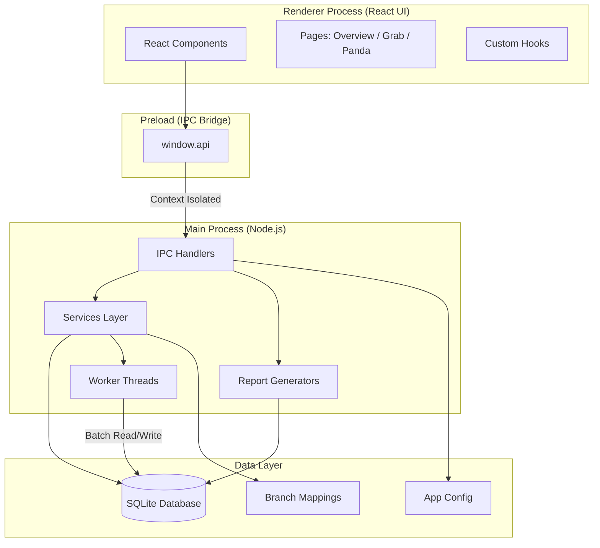
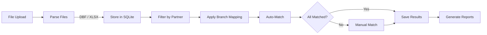

# Gi-Recon

**Automated Transaction Reconciliation for Giligan's Restaurant Chain**

`v1.0.0` | Windows Desktop | Electron + React + SQLite

---

## Project Overview

Gi-Recon is a desktop reconciliation tool built for Giligan's restaurant chain to automate the matching of point-of-sale (POS) transactions against third-party delivery partner reports from **Grab** and **Foodpanda**.

The restaurant chain operates 80+ branches nationwide, each generating hundreds of daily delivery orders across multiple platforms. Before Gi-Recon, the finance team manually compared POS records against partner statements — a process that was time-consuming, error-prone, and difficult to scale. Gi-Recon eliminates this bottleneck by automating transaction matching, flagging discrepancies, and producing actionable financial reports — reducing reconciliation time from days to minutes.

---

## Key Features

- **Automated Transaction Matching** — Intelligent algorithm matches POS entries to partner orders based on amount, date, and branch location with configurable tolerance (±0.05)
- **Manual Matching Workspace** — Drag-and-drop interface for resolving unmatched transactions through manual intervention
- **Multi-Partner Support** — Handles both Grab and Foodpanda with partner-specific parsing, filtering, and matching logic
- **Discrepancy Detection** — Identifies and quantifies amount differences, unmatched POS entries, and unmatched partner transactions
- **Comprehensive Reporting** — Dashboard with reconciliation summaries, branch performance metrics, partner sales breakdowns, and daily trend analysis
- **Branch Mapping Management** — Configurable mappings between POS branch codes and delivery partner store names (80+ branches)
- **Flexible Data Import** — Supports batch import from configured folders and manual single-file uploads for both POS (zipped DBF) and partner (Excel) data
- **Parallel Processing** — Worker threads for importing large datasets without blocking the UI
- **System Audit Trail** — Comprehensive logging of all reconciliation runs, data imports, and system events
- **Auto-Update** — Built-in update mechanism for seamless version distribution

---

## Architecture Overview



### Tech Stack

| Layer | Technology | Role |
|-------|-----------|------|
| **Frontend** | React 19, TypeScript, Tailwind CSS 4 | Type-safe component UI with utility-first styling |
| **Desktop Runtime** | Electron 39 | Cross-platform desktop shell with native OS integration |
| **Build Tooling** | electron-vite, Vite 7 | Fast dev server with HMR, optimized production builds |
| **Database** | SQLite via better-sqlite3 | Local, file-based relational storage with WAL mode |
| **File Parsing** | xlsx, dbffile, adm-zip, unzipper | Excel and legacy DBF format ingestion |
| **Parallel Processing** | Node.js Worker Threads | Non-blocking bulk data imports |
| **Packaging** | electron-builder (NSIS) | Windows installer generation |
| **Auto-Update** | electron-updater | GitHub-based automatic updates |
| **Code Quality** | ESLint, Prettier, TypeScript strict mode | Linting, formatting, and type safety |

---

## Data Sources

The system ingests transaction data from three sources, normalizing them into a unified database for reconciliation:

| Source | Format | Key Fields | Description |
|--------|--------|------------|-------------|
| **POS System** | DBF files (zipped) | Branch name, Order date, Amount (`grschrg`), Customer name/number | Transaction records from Giligan's POS, filtered by delivery partner identifiers in customer name |
| **Grab** | Excel (.xlsx/.xls) | Booking ID, Store name, Created on, Amount, Status, Category | Delivery orders from Grab; filtered to Completed/Transferred status, excluding Adjustments |
| **Foodpanda** | Excel (.xlsx/.xls) | Order Code, Partner name, Order date, Gross food value | Delivery invoices from Foodpanda with order codes and gross values |

---

## Core Reconciliation Process



### How It Works

1. **Data Import** — POS data is uploaded as a ZIP containing branch-organized DBF files. Partner data is uploaded as Excel files. Both are parsed and stored in the local SQLite database.

2. **Filtering** — POS transactions are filtered by customer name containing partner identifiers (e.g., "GRAB" or "PANDA"). Partner entries are filtered by date range and status.

3. **Branch Mapping** — POS branch names are resolved to partner store names using the configurable `branch_mapping` table (80+ branch entries).

4. **Automated Matching** — Transactions are matched by joining on branch mapping, comparing dates (same day), and validating amount equality within ±0.05 tolerance. Each POS entry and partner entry can only be matched once (deduplicated).

5. **Manual Resolution** — Remaining unmatched transactions are presented in a side-by-side workspace for manual pairing by the finance team.

6. **Finalization** — Matched and unmatched results are persisted to the `recon_results` table with match level classification (EXACT, TOLERANCE, MANUAL_SINGLE, MANUAL_BATCH, or NONE).

7. **Reporting** — Dashboard reports are generated from finalized data: reconciliation summaries, discrepancy details, branch performance, and partner sales breakdowns.

---

## IPC / API Reference

The application communicates between the React frontend and Node.js backend through Electron's IPC mechanism. All channels are exposed securely via the preload bridge (`src/preload/index.ts`).

### System & Configuration

| Channel | Description |
|---------|-------------|
| `window-minimize` | Minimize the application window |
| `window-maximize` | Toggle maximize/restore window state |
| `window-close` | Close the application (logs session end) |
| `write-log` | Insert a structured log entry into the audit trail |
| `config:read` | Read the current application configuration |
| `config:save` | Persist updated configuration to disk |

### Data Import

| Channel | Description |
|---------|-------------|
| `POS:importZip` | Import POS data from a ZIP file containing branch-organized DBF files (parallel workers) |
| `import:manual` | Import a single partner Excel file via file picker dialog |
| `import:batch` | Bulk-import all Excel files from a configured folder (parallel workers) |

### Reconciliation

| Channel | Description |
|---------|-------------|
| `run-recon` | Execute automated reconciliation for a partner within a date range and optional branch filter |
| `save-recon` | Persist reconciliation results (matched + unmatched) to the database |
| `get-branches` | Retrieve branch mapping data for a specific partner |

### Reports

| Channel | Description |
|---------|-------------|
| `report:overview` | Dashboard summary: totals, partner breakdown, daily trend, top branches |
| `report:reconSummary` | Per-branch reconciliation metrics (match counts, rates, amounts) |
| `report:discrepancy` | Transactions with amount mismatches between POS and partner |
| `report:unmatched` | Transactions that could not be matched |
| `report:partnerSales` | Partner sales breakdown (gross, commission, tax, net) |
| `report:branchPerformance` | Per-branch performance across all partners |
| `report:systemLogs` | Filtered audit trail entries |

> Full API signatures and type definitions are located in `src/preload/index.ts` and `src/main/types.ts`.

---

## Database Schema

All data is stored locally in a SQLite database (`pos.db`) in the user's app data directory. WAL mode is enabled for concurrent read performance.

| Table | Purpose | Key Fields |
|-------|---------|------------|
| `pos_transactions` | POS sales records from all branches | branch, cslipno, orddate, grschrg, cusname — unique on (branch, cslipno) |
| `grab_transactions` | Grab delivery platform orders | booking_id (unique), store_name, created_on, amount, status, category |
| `foodpanda_transactions` | Foodpanda delivery invoices | order_code (unique), partner_name, order_date, gross_food_value |
| `recon_results` | Reconciliation outcomes linking POS to partner entries | pos_id, partner_id, partner_type, match_level, recon_status, amount_difference |
| `branch_mapping` | Maps POS branch codes to partner store names | pos_code (PK), pos_name, grab_name, foodpanda_name |
| `system_logs` | Audit trail for all system events | timestamp (auto), level, module, action, message, user_name |

---

## Getting Started

### Prerequisites

| Requirement | Details |
|-------------|---------|
| **Node.js** | v18 or higher (v20 LTS recommended) |
| **npm** | Included with Node.js |
| **OS** | Windows 10/11 (build and runtime target) |
| **Build Tools** | Visual Studio Build Tools with C++ workload (required for `better-sqlite3` native compilation) |

### Installation

```bash
git clone <repository-url>
cd gi-recon
npm install
```

> The `postinstall` script automatically rebuilds native dependencies (better-sqlite3) for the Electron runtime.

### Development

```bash
npm run dev
```

Opens the app with hot-reload. Renderer changes reflect instantly; main process changes trigger an automatic restart.

### Build & Package

```bash
# Type-check and compile (output: out/)
npm run build

# Preview the compiled app
npm start

# Package as Windows installer (output: dist/Gi-Recon-Setup-1.0.0.exe)
npm run build:win

# Package unpacked for testing (no installer)
npm run build:unpack
```

### Code Quality

```bash
npm run lint        # ESLint with caching
npm run format      # Prettier formatting
npm run typecheck   # TypeScript strict checking (main + renderer)
```

---

## Folder Structure

```
gi-recon/
├── build/                  # Build resources (icons, installer assets)
├── resources/              # App icons (ico, png)
├── src/
│   ├── main/               # Electron main process
│   │   ├── ipc/            # IPC handler registrations (system, import, recon, reports)
│   │   ├── services/       # Business logic (reconService, ingestDataService, logService, branchMappingService)
│   │   ├── reports/        # Report query generators (7 report types)
│   │   ├── worker/         # Worker threads for parallel data processing
│   │   │   └── pos/        # POS-specific reader/writer workers
│   │   ├── db.ts           # Database initialization and schema
│   │   ├── config.ts       # App configuration read/write
│   │   ├── constants.ts    # SQL statements and row mappers
│   │   ├── types.ts        # TypeScript type definitions
│   │   └── utils.ts        # Shared utilities (DB singleton)
│   ├── preload/            # Secure IPC bridge (contextBridge)
│   └── renderer/           # React frontend
│       └── src/
│           ├── components/ # UI components (tables, modals, shared)
│           ├── hooks/      # Custom React hooks
│           ├── layouts/    # Page layout wrappers
│           ├── lib/        # Utility libraries
│           └── pages/      # Route pages (Overview, Grab, Panda)
├── types/                  # Shared type declarations
├── branches.json           # Branch mapping seed data (80+ entries)
├── electron.vite.config.ts # Vite config for Electron (main, preload, renderer)
├── electron-builder.yml    # Packaging config (NSIS installer, ASAR settings)
├── package.json            # Dependencies and scripts
└── tsconfig.json           # TypeScript configuration
```

---

## User Workflow

### 1. Setup & Configuration

- Launch Gi-Recon
- Configure branch mappings if new branches have been added (POS codes → partner store names)
- Set POS import parameters (year, month, ZIP password) in app settings

### 2. Data Import

- **POS Data**: Upload a ZIP file containing branch-organized DBF files → processed via parallel worker threads
- **Partner Data**: Upload Grab or Foodpanda Excel files (manual single-file or batch from configured folder)
- Progress feedback is provided during import; errors are logged without blocking the entire batch

### 3. Automated Reconciliation

- Select partner type (Grab or Panda), date range, and optionally a specific branch
- Run reconciliation — the system auto-matches transactions and presents results
- Review match statistics: exact matches, tolerance matches, and unmatched counts

### 4. Manual Matching

- Use the side-by-side matching workspace to pair remaining unmatched transactions
- Confirm manual matches individually or in batches

### 5. Finalization & Reporting

- Save reconciliation results to the database
- View the Overview dashboard for cross-partner metrics and trends
- Drill into specific reports: discrepancy details, unmatched items, branch performance, partner sales
- Repeat for different date ranges or partners as needed

---

## Design System

The application follows a consistent visual design language built on Tailwind CSS. The full design system is documented in [`design.md`](./design.md).

### Color Palette

| Role | Color | Tailwind Class |
|------|-------|----------------|
| **Primary / Actions** | Indigo | `indigo-600` |
| **Success / Matched** | Emerald | `emerald-600` |
| **Warning / Pending** | Amber | `amber-500` |
| **Error / Critical** | Red | `red-600` |
| **Info / Hints** | Blue | `blue-500` |
| **Backgrounds** | Slate | `slate-50` / `white` |
| **Text** | Slate | `slate-900` (primary) / `slate-500` (secondary) |

### Key Patterns

- **Typography**: System sans-serif stack, scale from `text-xs` to `text-4xl`
- **Cards**: `rounded-2xl`, `shadow-sm`, `border-slate-200` with hover elevation
- **Buttons**: `rounded-lg`, `active:scale-95`, `transition-all duration-300`
- **Focus states**: `ring-2 ring-indigo-500` for keyboard accessibility
- **Transitions**: 300ms ease-in-out for all interactive elements

---

## Security & Data Integrity

### Local-First Architecture

All data processing and storage occurs locally on the user's machine. No transaction data is transmitted externally. The SQLite database resides in the OS-protected app data directory.

### Data Integrity

- **Atomic Transactions** — All imports and reconciliation saves use SQLite transactions; failures trigger full rollback
- **Deduplication** — Unique constraints on key fields (booking_id, order_code, branch+cslipno) prevent duplicate entries
- **Validation** — Input validation during file parsing catches malformed data before database insertion

### Error Handling

- **Graceful Degradation** — Individual file failures during batch import are logged without stopping the overall process
- **Password Protection** — POS ZIP files support password-protected extraction with clear error messaging on failure
- **Audit Trail** — All reconciliation runs, saves, and errors are recorded in `system_logs` with timestamps and context

### Process Isolation

- **Context Isolation** — Renderer process is fully isolated from Node.js APIs; all backend access goes through the secure preload bridge
- **Worker Threads** — Heavy data processing runs in separate threads, preventing UI freezes and isolating import failures

---

## Auto-Update & Distribution

Gi-Recon is distributed as a Windows NSIS installer (`Gi-Recon-Setup-{version}.exe`). The installer provides:

- Custom installation directory selection
- Desktop shortcut creation
- Standard Windows uninstall support

**Automatic Updates** are handled via `electron-updater`, which checks a configured GitHub repository for new releases. When an update is available, the app downloads and applies it on the next restart — no manual intervention required.

### Build Artifacts

| Command | Output | Purpose |
|---------|--------|---------|
| `npm run build:win` | `dist/Gi-Recon-Setup-1.0.0.exe` | Production installer for distribution |
| `npm run build:unpack` | `dist/win-unpacked/` | Unpacked app for internal testing |

---

<p align="center">
  <strong>Gi-Recon v1.0.0</strong> — Built by Giligans Tech Team<br>
  Last updated: August 2026
</p>
